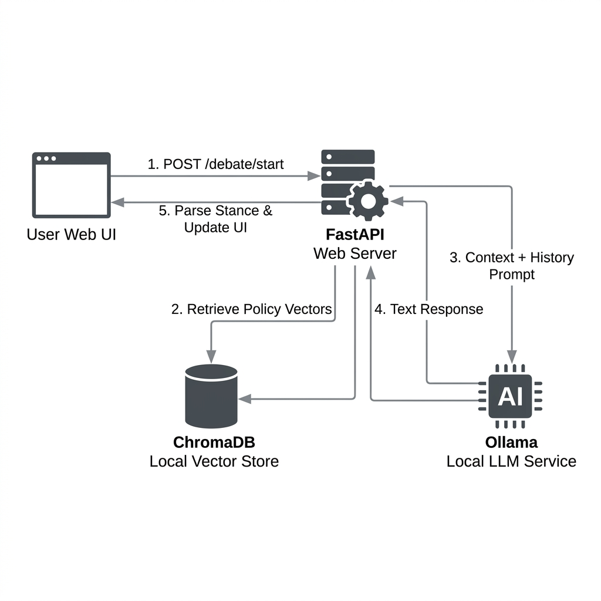
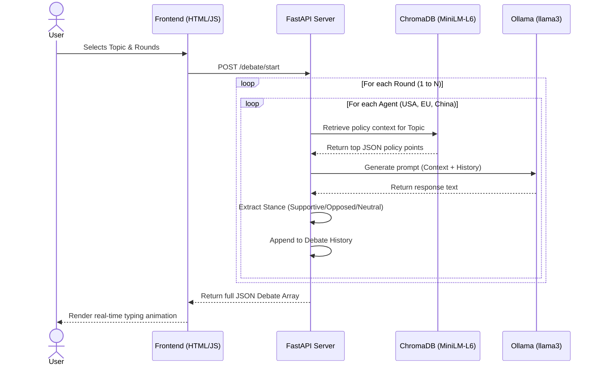

# 🌍 Global Climate Debate AI Simulator


A state-of-the-art multi-agent AI application simulating a structured climate policy debate between the **USA**, **EU**, and **China**. The simulation uses local vector databases and large language models (LLMs) to showcase how international policy stands are evaluated and challenged under different topic scenarios.

This system integrates a **ChromaDB**-powered Retrieval-Augmented Generation (RAG) engine to ground each agent's arguments in real-world policy documents. It orchestrates the turns via **Ollama**, exposes endpoints via **FastAPI**, and presents a premium, real-time typing UI for interactive user engagement.

---

## 🏗️ System Architecture & Workflow

The simulation is built on a decoupled, multi-layered architecture where each agent behaves as a separate debater with access to a localized policy knowledge base.

<p align="center">
  
</p>

### 🔄 Multi-Agent Interaction Sequence



### Key Components:
1. **Frontend Dashboard (`static/`)**: A glassmorphic web UI that allows users to start debates and renders agent interactions dynamically using auto-scroll typing animations and stance badges.
2. **FastAPI Web Server (`main.py`)**: Manages routing, endpoints, and orchestrates debate sequencing.
3. **Local RAG Service (`core/rag_service.py`)**: Embedded `SentenceTransformers` model and a local `ChromaDB` instance to store, index, and retrieve policy JSON sections on demand.
4. **Debater Agent Orchestrator (`agents/debater.py`)**: Formulates the prompt with history context, calls the local LLM, parses the output using regex-based stance classifiers, and handles timestamps.

---

## 🌍 Real-World Use Cases

Multi-agent RAG simulation engines are powerful tools that extend far beyond classroom exercises:

1. **Geopolitical Risk Analysis**: Simulates how different world powers will react to sudden international policy shifts (e.g., carbon border adjustments, climate tariffs).
2. **Diplomatic Training & Roleplay**: Trains negotiators and foreign service officers to anticipate red lines and official stances of opposing delegations.
3. **Corporate Policy Strategy**: Allows enterprises to stress-test corporate policies against complex environmental regulations from multiple jurisdictions.

---

## ⚡ Technical Highlights & Optimizations

- **Ollama Timeout Safeguard**: To prevent FastAPI worker thread starvation when Ollama is under high load, requests are capped with a 3-minute timeout (`timeout=180.0`).
- **Cold-Start Elimination**: The Sentence Transformers model (`all-MiniLM-L6-v2`) is baked directly into the Docker image during the build phase. This prevents cold-start delays.
- **Redundant Embeddings Optimization**: Before populating ChromaDB, the RAG service checks if the collection is already initialized (`self.collection.count() == 0`), saving significant GPU/CPU overhead during app startup.
- **Hardware Acceleration**: The `docker-compose.yml` is configured with native NVIDIA GPU pass-through to support GPU-accelerated local inference.

---

## 📋 Rubric Alignment Matrix

| Requirement | Implementation Location | Description |
|---|---|---|
| **RAG System** | [rag_service.py](file:///d:/GPP/task24/ClimateDebateAI/core/rag_service.py) | Uses `chromadb` to ingest and query local JSON policies. |
| **Debate Sequence** | [main.py](file:///d:/GPP/task24/ClimateDebateAI/main.py) | Orchestrates a fixed turn-order (USA -> EU -> China) via nested loops. |
| **JSON Schema** | [debater.py](file:///d:/GPP/task24/ClimateDebateAI/agents/debater.py) | Parses stance and generates strict ISO-8601 UTC `Z` timestamps. |
| **Error Handling** | [debater.py](file:///d:/GPP/task24/ClimateDebateAI/agents/debater.py) | Translates LLM connection/OOM crashes to HTTP 500 responses. |
| **Healthchecks** | [docker-compose.yml](file:///d:/GPP/task24/ClimateDebateAI/docker-compose.yml) | API uses `curl`, Ollama uses `ollama list`. |
| **Testing** | [test_debate.py](file:///d:/GPP/task24/ClimateDebateAI/tests/test_debate.py) | Mocks LLM to verify schemas, counts, and turn orders. |

---

## 🚀 Setup & Execution

### 1. Configuration
Copy the `.env.example` file to `.env`:
```bash
cp .env.example .env
```

### 2. Start the Environment
Boot up the complete containerized environment using Docker Compose:
```bash
docker-compose up -d --build
```

### 3. Pull the LLM Model
Ensure the required model is loaded into your local Ollama instance:
```bash
docker-compose exec ollama ollama pull llama3:8b
```

### 4. Automated Testing
Run the automated test suite within the running API container:
```bash
docker-compose exec api /bin/sh -c "pip install pytest httpx && python -m pytest tests/test_debate.py -v"
```

### 5. Accessing the Application
- **Frontend Dashboard**: [http://localhost:8000/](http://localhost:8000/)
- **Swagger API Docs**: [http://localhost:8000/docs](http://localhost:8000/docs)
- **Health Endpoint**: [http://localhost:8000/health](http://localhost:8000/health)
