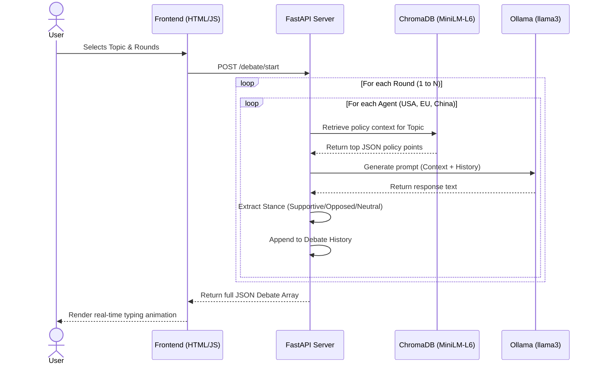

# 🌍 Global Climate Debate AI Simulator


A multi-agent AI application that simulates a structured, highly-detailed debate on climate policy between the **USA**, **EU**, and **China**. 

This system uses a **ChromaDB**-powered Retrieval-Augmented Generation (RAG) engine to strictly ground each agent's arguments in their real-world policy documents, orchestrating the debate via **Ollama** and **FastAPI**, and rendering it in real-time through a premium frontend UI.

---

## ⚡ Technical Highlights & Optimizations

- **Hardware Acceleration:** Native NVIDIA GPU pass-through configured in `docker-compose.yml` for lightning-fast local LLM inference.
- **Optimized Docker Builds:** Utilizes the blazing-fast `uv` package manager. The heavy `all-MiniLM-L6-v2` embedding model is baked directly into the Docker image during the build phase, eliminating the cold-start "freeze" and latency.
- **Robust Error Handling:** Strict `try/except` guardrails ensure the API safely intercepts LLM connection errors and Out-Of-Memory (OOM) crashes, gracefully translating them into human-readable HTTP 500 errors.
- **Automated Testing Suite:** Comprehensive `pytest` coverage mocking the LLM to verify exact turn-ordering, schema validation, and strict ISO-8601 formatting.

## 🏗️ System Architecture



## 📋 Rubric Alignment Matrix

| Requirement | Implementation Location | Description |
|---|---|---|
| **RAG System** | `core/rag_service.py` | Uses `chromadb` to ingest and query local JSON policies. |
| **Debate Sequence** | `main.py` | Orchestrates a fixed turn-order (USA -> EU -> China) via nested loops. |
| **JSON Schema** | `agents/debater.py` | Parses stance and generates strict ISO-8601 UTC `Z` timestamps. |
| **Error Handling** | `agents/debater.py` | Translates LLM connection/OOM crashes to HTTP 500 responses. |
| **Healthchecks** | `docker-compose.yml` | API uses `curl`, Ollama uses `ollama list`. |
| **Testing** | `tests/test_debate.py` | Mocks LLM to verify schemas, counts, and turn orders. |

---

## 🚀 Setup & Execution

### 1. Requirements
- Docker and Docker Compose
- (Optional) NVIDIA GPU for hardware acceleration

### 2. Configuration
Copy the `.env.example` to `.env`. The project is configured out-of-the-box for `llama3:8b` as per production standards.
```bash
cp .env.example .env
```

### 3. Start the Environment
Boot up the complete, containerized environment:
```bash
docker-compose up -d --build
```

### 4. Pull the LLM Model
Ensure the required model is loaded into your local Ollama instance:
```bash
docker-compose exec ollama ollama pull llama3:8b
```

### 5. Automated Testing
To run the automated `pytest` suite inside the container environment:
```bash
docker-compose exec api /bin/sh -c "pip install pytest httpx && python -m pytest tests/test_debate.py -v"
```

### 6. Access the Application
- **Frontend UI**: [http://localhost:8000/](http://localhost:8000/)
- **API Docs**: [http://localhost:8000/docs](http://localhost:8000/docs)
- **Health Check**: [http://localhost:8000/health](http://localhost:8000/health)

---
*Built for the Advanced Agentic Coding Evaluation.*
